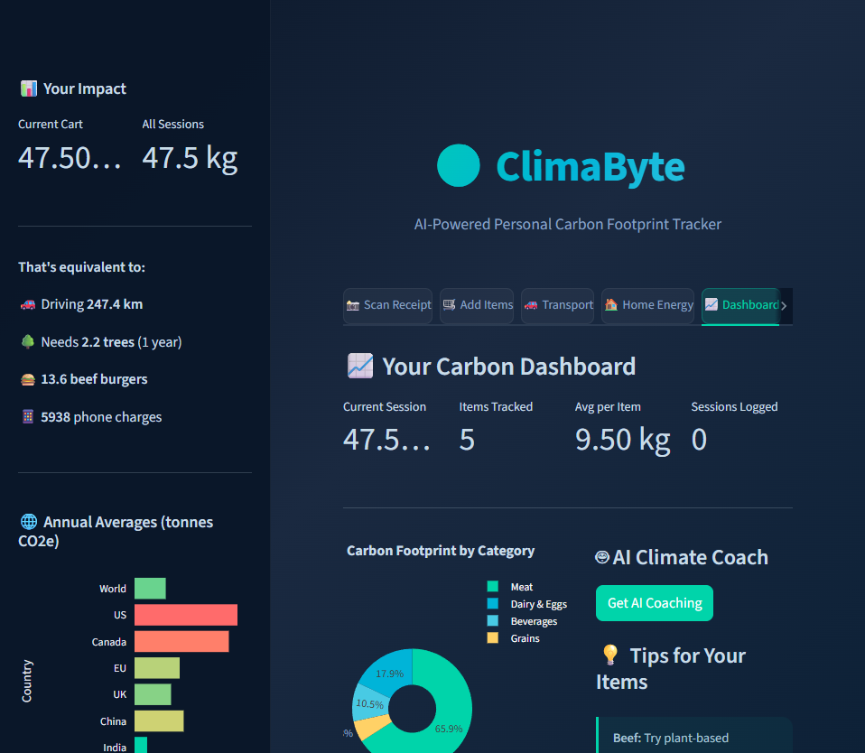
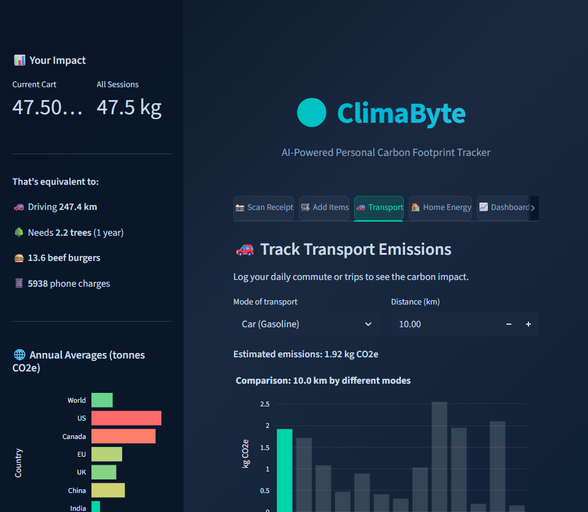
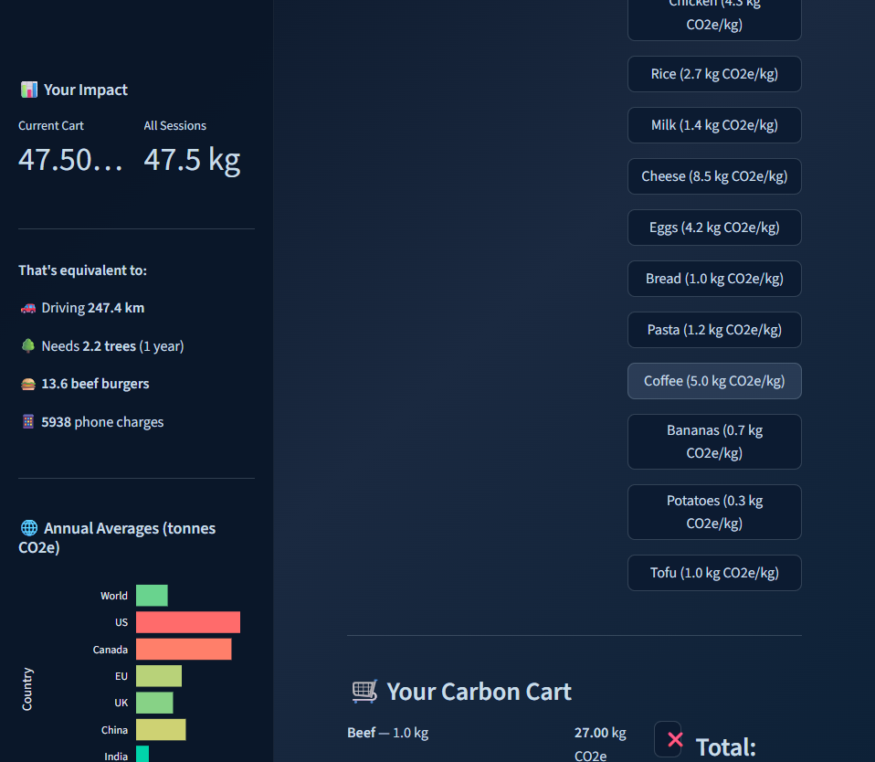
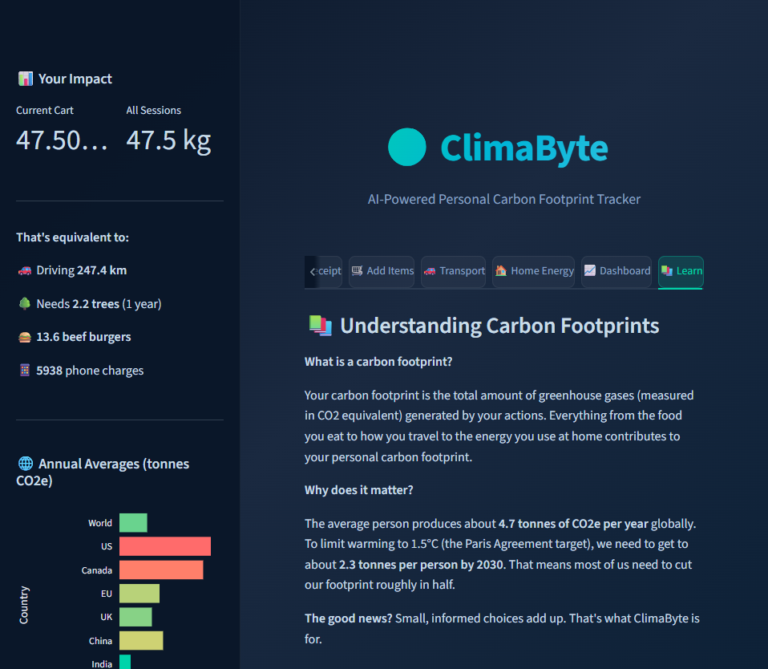

<div align="center">

# 🌍 ClimaByte

### AI-Powered Personal Carbon Footprint Tracker

**Frostbyte Hackathon 2026 — Sustainability & Climate Tech**

[](https://climabyte.streamlit.app)


*Scan receipts. Track your impact. Save the planet — one purchase at a time.*

</div>

---

## 📸 Screenshots

<div align="center">

| Dashboard with Live Analytics | Transport Emissions Comparison |
|:---:|:---:|
|  |  |

| Food & Grocery Tracker | Learn & Discover |
|:---:|:---:|
|  |  |

</div>

---

## 🎯 What It Does

| Feature | Description |
|---------|-------------|
| 📸 **Scan Receipts** | Upload a grocery receipt photo — Claude Vision extracts items and calculates carbon footprint instantly |
| 🛒 **Manual Tracking** | Search or browse **80+ food items** with real emission data from EPA/DEFRA |
| 🚗 **Transport Tracker** | Log commutes across **15 transport modes** with side-by-side comparisons |
| 🏠 **Home Energy** | Track electricity & heating by source (including Quebec's near-zero hydro grid!) |
| 🤖 **AI Climate Coach** | Personalized, encouraging tips from Claude — data-driven, never preachy |
| 📈 **Visual Dashboard** | Interactive Plotly charts: category breakdown, item comparison, country benchmarks |
| 📚 **Learn** | Educational content with food comparisons, top 5 actions, and data sources |

---

## 💡 Why ClimaByte?

> **People can't change what they can't measure.**

Most people want to reduce their carbon footprint but have **no idea where to start**. ClimaByte bridges the knowledge gap:

- 👁️ **See the impact** of every purchase in kg CO₂e
- 🔄 **Compare alternatives** — "What if I swapped beef for chicken?"
- 🤖 **Get coached** by AI that's encouraging, not judgmental
- 📊 **Track progress** with beautiful, real-time visualizations
- 🌍 **Benchmark yourself** against global and country averages

---

## 🛠️ Tech Stack

| Layer | Technology | Why |
|:------|:----------|:----|
| **Language** | Python 3.12 | Massive AI ecosystem, hackathon-proven |
| **Frontend** | Streamlit 1.55 | Production-quality web UI from pure Python |
| **AI Brain** | Claude API (claude-sonnet-4-6) | Multimodal vision + structured JSON + natural coaching |
| **Carbon Data** | Built-in DB (80+ items) | Real emission factors from EPA, DEFRA, Climatiq OEFDB |
| **Charts** | Plotly Express | Interactive, beautiful, responsive visualizations |
| **Image Processing** | Pillow (PIL) | Receipt photo handling before Claude Vision |
| **Deployment** | Streamlit Community Cloud | Free, instant, auto-deploy from GitHub |

> **Total cost: $0** — Everything runs on free tiers.

---

## 🚀 Quick Start

```bash
# Clone
git clone https://github.com/limem01/climabyte.git
cd climabyte

# Setup
python -m venv venv
source venv/bin/activate        # Windows: venv\Scripts\activate
pip install -r requirements.txt

# Run
streamlit run app.py
```

Opens at `http://localhost:8501` ✨

### 🔑 API Keys (Optional)

| Key | Required? | What it unlocks |
|:----|:----------|:---------------|
| [Anthropic Claude](https://console.anthropic.com/) | Optional | Receipt scanning (Vision) + AI coaching |
| [Climatiq](https://app.climatiq.io/) | Optional | Enhanced emission data |

> The app works **fully without any API keys** using the built-in emission factor database.

---

## 🏗️ How We Built It

ClimaByte was built for the **Frostbyte Hackathon 2026**. The core insight: *people can't change what they can't measure*.

### Architecture

```
📸 Receipt Photo → Claude Vision → Structured JSON → Emission Database Match → CO₂e Calculation
                                                                                    ↓
🛒 Manual Entry ────────────────────────────────────────→ Carbon Engine ──→ Dashboard + Charts
                                                              ↑                     ↓
🚗 Transport / 🏠 Energy ──────────────────────────────────────┘              🤖 AI Coach Tips
```

**Key decisions:**
- **Built-in emission data** (not API-only) so the app works even offline
- **Claude claude-sonnet-4-6** for the perfect balance of speed, intelligence, and cost
- **Streamlit** for rapid prototyping — professional UI in hours, not weeks
- **Session-based storage** for hackathon simplicity (Firebase/Supabase planned for v2)

### Carbon Data Sources

All emission factors come from peer-reviewed, authoritative sources:

- **Climatiq OEFDB** — Open Emission Factor Database
- **EPA** — US Environmental Protection Agency
- **DEFRA** — UK Dept. for Environment, Food & Rural Affairs
- **Our World in Data** — Oxford lifecycle analyses
- **IPCC AR6** — Intergovernmental Panel on Climate Change

---

## 📊 Impact by the Numbers

| Metric | Value |
|:-------|:------|
| Food items tracked | **80+** with real CO₂e data |
| Transport modes | **15** from walking to long-haul flights |
| Energy sources | **9** including Quebec hydro (0.002 kg/kWh!) |
| Country benchmarks | **10** including Paris 1.5°C target |
| API cost | **$0** for full functionality |

---

## 🔮 What's Next

- [ ] 🔥 Firebase/Supabase persistent storage
- [ ] 📧 Weekly/monthly progress reports via email
- [ ] 📱 Barcode scanning for packaged products
- [ ] 👨‍👩‍👧‍👦 Household mode (track family footprint)
- [ ] 🌱 Carbon offset marketplace integration
- [ ] 📲 Mobile PWA wrapper
- [ ] 🏆 Social features — compare with friends, community challenges

---

## 👤 Author

<div align="center">

**Khalil Limem**

Full-stack developer passionate about using AI to solve real-world problems.

[](https://github.com/limem01)
[](mailto:khalillimem@outlook.com)

---

*Built with 🌍 for the Frostbyte Hackathon 2026*

</div>
